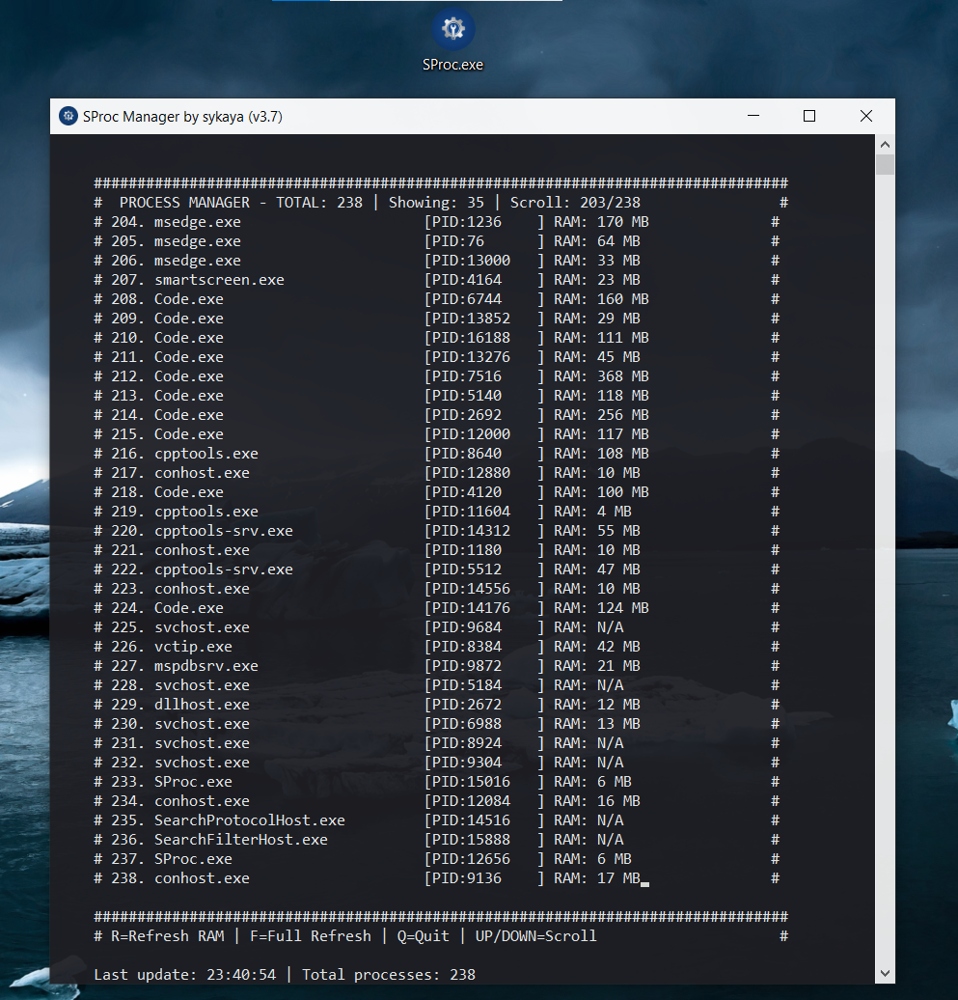

# 🖥️ FProc - Windows Process Monitor

<p align="center">
  
  <br>
  <em>Professional Windows process monitoring tool with real-time system insights</em>
</p>

<p align="center">
  
  
  
  
</p>

## 📖 Table of Contents
- [✨ Features](#-features)
- [🚀 Quick Start](#-quick-start)
- [🔧 Build Instructions](#-build-instructions)
- [🎯 Usage](#-usage)
- [📁 Project Structure](#-project-structure)
- [🛠️ Technical Details](#-technical)
- [📸 Screenshot](screenshot/image.png)
- [🤝 Contributing](#-contributing)
- [📄 License](LICENSE)

## ✨ Features

### 🔍 **Real-time Monitoring**
- **Live Process Enumeration** - Up-to-date list of all running processes
- **Dynamic Memory Tracking** - Real-time RAM usage per process (MB/KB)
- **Process Details** - PID, name, and resource consumption

### 🎨 **User Interface**
- **Console GUI** - Clean, flicker-free interface with partial screen updates
- **Keyboard Controls** - Intuitive navigation (Scroll, Refresh, Quit)
- **Responsive Design** - Adapts to console window size
- **Process Filtering** - Smart display with scrollable lists

### ⚡ **Performance**
- **Efficient Updates** - Partial screen refresh minimizes flickering
- **Low Resource Usage** - Lightweight native Windows application
- **Fast Response** - Instant process listing and updates

### 🔧 **Technical**
- **Windows API Integration** - Direct system calls for maximum performance
- **Modern C++17** - Clean, maintainable codebase
- **CMake Build** - Cross-platform build configuration

## 🚀 Quick Start

### Prerequisites
- Windows 10/11
- CMake 3.10+
- C++17 compatible compiler (MSVC, MinGW)
- Git

### Clone & Build
```bash
# Clone the repository
git clone https://github.com/Flexsz/FProc.git
cd FProc

# Create build directory
mkdir build && cd build

# Configure with CMake (MinGW)
cmake .. -G "MinGW Makefiles"

# Build the project
mingw32-make

# Run the executable
./FProc.exe
